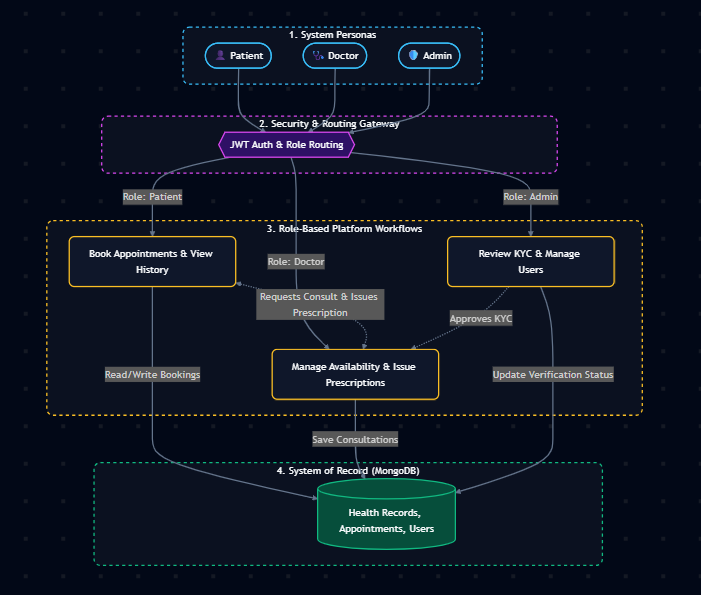

# HealthSync

A robust, full-stack healthcare management web application designed to streamline patient-doctor interactions, simplify appointment booking, and manage digital prescriptions securely.

[**Live Demo**](https://healthcare-management-system-seven-rouge.vercel.app/)

## 📸 Application Overview

| Doctor Dashboard | booking appointments (patient) |
| :---: | :---: |
|  |  |
| **Admin Interface** | **AI Symptom checker (patient)** |
|  |  |

---
## Tech Stack
*   **Frontend:** React.js, Vite, Axios
*   **Backend:** Node.js, Express.js
*   **Database:** MongoDB
*   **Authentication:** JWT (JSON Web Tokens)
*   **Deployment:** Vercel (Frontend), Render (Backend)


---

### 🏗️ Technical Architecture

---
 <div align="center"></div>


## ✨ Key Features

*   **Role-Based Access Control (RBAC):** Dedicated, secure authentication portals and customized dashboards for Patients, Doctors, and Admins.
*   **AI-Powered Symptom Checker:** Integrated AI assistant that helps patients analyze their symptoms and suggests appropriate medical specialties for consultation.
*   **Dynamic QR Code Scanning:** Automated appointment verification and secure patient check-ins using dynamically generated and scannable QR codes.
*   **Comprehensive Admin Portal:** Centralized management dashboard for processing doctor verifications (KYC workflows), monitoring platform notifications, and overseeing user activity.
*   **Appointment Management:** Streamlined scheduling system for booking, tracking, and managing health consultations and prescriptions.
*   **Secure API Architecture:** Implemented with strict CORS policies, environment variable isolation, and stateless JWT authentication to protect protected routes.
*   **Dynamic Data Handling:** RESTful API endpoints (`/api/*`) for fetching real-time notifications, KYC metrics, and user profiles.

---

## 🚀 Local Development Setup

To run this project locally, ensure you have Node.js and a MongoDB instance running.

### 1. Clone the Repository
```bash
git clone https://github.com/mathewan10y/healthcare_management_system.git
cd healthcare_management_system
```

### 2. Backend Setup
Navigate to the backend directory and install dependencies:
```bash
cd backend
npm install
```
Create a `.env` file in the `backend` directory with the following variables:
```text
MONGODB_URI=your_mongodb_connection_string
JWT_SECRET=your_super_secret_key
FRONTEND_URL=http://localhost:5173
NODE_ENV=development
```
Start the backend server:
```bash
npm run start
```

### 3. Frontend Setup
Open a new terminal window, navigate to the frontend directory, and install dependencies:
```bash
cd frontend
npm install
```
Create a `.env` file in the `frontend` directory:
```text
VITE_API_URL=http://localhost:5000/api
```
Start the frontend development server:
```bash
npm run dev
```